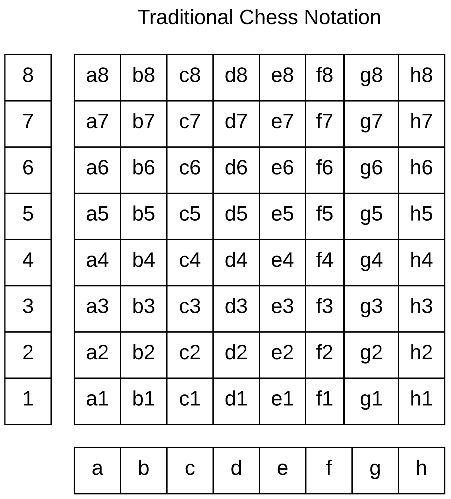
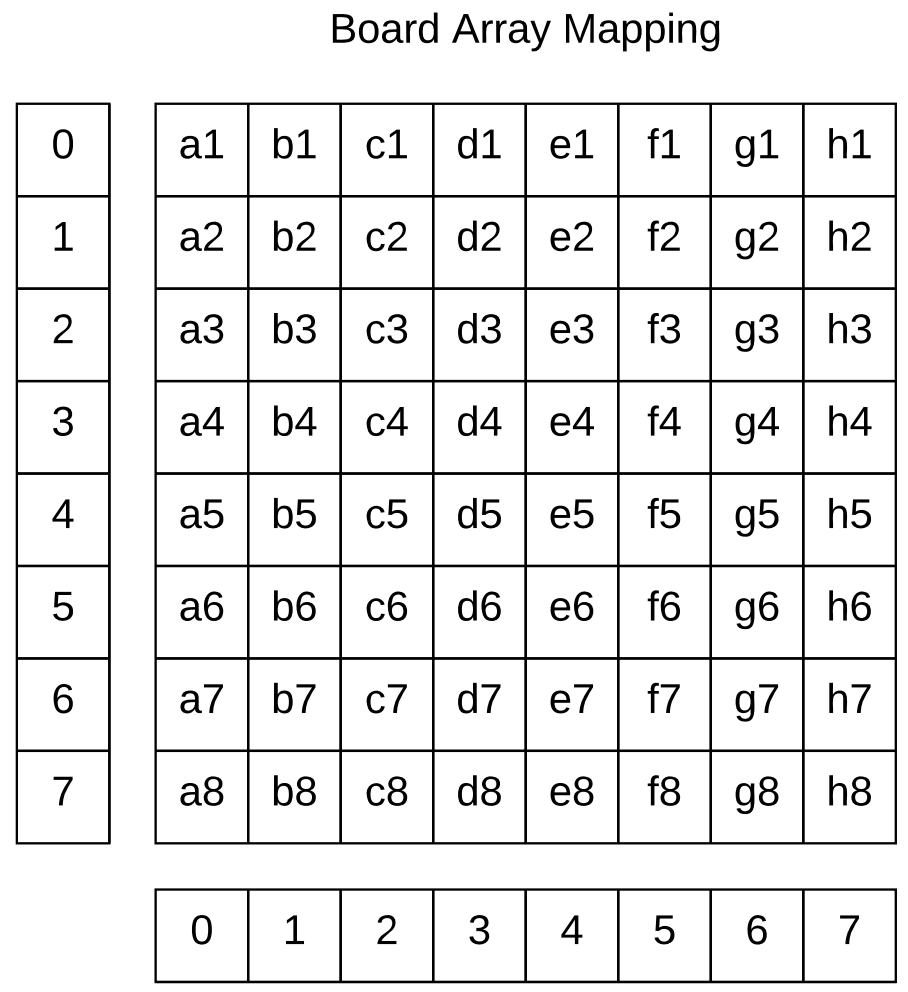

# Chess Game (Refactored)

## Overview
- A Bite-Sized Commit Tutorial Project
- This project converts [this][original-chess-game-repo] Java Chess repository into a tutorial with step-by-step commits.

**Project SDK**: Java 1.8 (1.8.0_144)

- [Step 0 - Piece Creation](#step-0)
- [Step 1 - Piece Symbols & Colors](#step-1)
- [Step 2 - Piece Constructor Implementation & Coordinate Positions](#step-2)
- [Step 3 - Chess Board Array & Coordinate Validation](#step-3)
- [Step 4 - Initialize Board Pieces](#step-4)
- [Step 5 - Piece Movement & Example Game](#step-5)
- [Step 6 - Checking Valid Moves Based On Start & End Positions](#step-6)
- [Step 7 - Checking For Valid Knight Moves](#step-7)
- [Step 8 - Checking For Valid Diagonal Moves](#step-8)
- [Step 9 - Checking For Valid Vertical/Horizontal Moves](#step-9)
- [Step 10 - Checking For Valid King Moves](#step-10)
- [Step 11 - Checking For Valid Pawn Moves (2-Space Forward Moves)](#step-11)
- [Step 12 - Checking For Valid Pawn Moves (1-Space Forward & Diagonal Moves)](#step-12)
- [Step 13 - Exception Handling For Invalid Moves](#step-13)
- [Step 14 - Verifying That Moves Are Valid Based On Whether Or Not King Is In Check](#step-14)
- [Step 15 - Determining Whether Or Not King Is In Check](#step-15)
- [Step 16 - Determining Whether Or Not King Is In Checkmate](#step-16)
- [Step 17 - Determining Whether Or Not Check Is Blockable](#step-17)
- [Step 18 - Determining Whether Or Not A Stalemate Has Occured](#step-18)
- [Step 19 - Determining Whether Or Not Any Pieces Are Moveable For Stalemate](#step-19)
- [Step 20 - Calculating Possible Moves](#step-20)
- [Step 21 - Adding Check, Checkmate, & Stalemate Verification To Movement Method](#step-21)
- [Step 22 - Castling](#step-22)
- [Step 23 - Making The Game Playable](#step-23)

## Commits / Tutorial Outline

You can check out any point of the tutorial using:

```
git checkout step-?
```

To see the changes made between any two lessons use the `git diff` command:

```
git diff step-?..step-?

```

## Steps

### Step 0
#### Piece Creation ([Diff][diff-0])
    - Created initial Java Project using IntelliJ
    - Created Chess Piece classes
    - King, Queen, Rook, Bishop, Knight, Pawn extend abstract class Piece

#### Reset Instructions:
```
git checkout -f step-0
```
#### Keywords: *class*, *abstract*, *extends*

### Step 1
#### Piece Symbols & Colors ([Diff][diff-1])
    - Added Unicode constants into each Chess piece symbol
    - Created Enum for piece color
    - Created attributes for Piece color and symbol
    - Added getters/setters for Piece color and symbol, including abstract setPieceSymbol() method
    - Implemented setPieceSymbol() in each subclass

#### Reset Instructions:
```
git checkout -f step-1
```
#### Keywords: *enum*, *static*, *final*, *void*, *protected*, *attribute*, *method*, *getter*, *setter*

### Step 2
#### Piece Constructor Implementation & Coordinate Positions ([Diff][diff-2])
    - Added Coordinate class for piece positioning
    - Coordinate will allow you to interchange string (e.g. 'd4') and integer (e.g. (2, 5)) board positions
    - Added Coordinate attribute to Piece class
    - Modified piece constructors to use pieceColor and pieceStringPos

#### Reset Instructions:
```
git checkout -f step-2
```
#### Keywords: *constructor*, *super*

### Step 3
#### Chess Board Array & Coordinate Validation ([Diff][diff-3])
    - Created Board class with boardArray attribute
    - Created BoardUtility to provide static helper methods
    - Modified Coordinate to dynamically calculate integer board positions (posX and posX) from chessStringPos

#### Reset Instructions:
```
git checkout -f step-3
```

### Step 4
#### Initialize Board Pieces ([Diff][diff-4])
    - Added methods to BoardUtility to populate Board's boardArray
    - boardArray is a 2-D array that contains Piece objects
    - The mappings from traditional board notation to the boardArray indices are:
        - 
        - 
    - Created PlayChess class to run the program and display the chess board on the console

#### Reset Instructions:
```
git checkout -f step-4
```

### Step 5
#### Piece Movement & Example Game ([Diff][diff-5])
    - Added method to Board to make Chess moves
    - Updated PlayChess to show an example game

#### Reset Instructions:
```
git checkout -f step-5
```

### Step 6
#### Checking Valid Moves Based On Start & End Positions ([Diff][diff-6])
    - Created MoveUtility class to store methods that validate moves
    - Implemented isValidEndpoints() to validate moves solely on piece color
    - Started implementing isValidPath() to check for piece specific movement validation
    - Modified PlayChess to demonstrate isValidEndpoints()

#### Reset Instructions:
```
git checkout -f step-6
```

### Step 7
#### Checking For Valid Knight Moves ([Diff][diff-7])
    - Added method isValidKnightMove() to MoveUtility to check for legal start and end Coordinates
    - Added helper methods subtractXCoordinates() and subtractYCoordinates()
    - Continued implementing isValidPath()

#### Reset Instructions:
```
git checkout -f step-7
```

### Step 8
#### Checking For Valid Diagonal Moves ([Diff][diff-8])
    - Added isValidDiagonalPath() to check that two Coordinates form an unobstructed diagonal path
    - Added helper methods to the Coordinate class

#### Reset Instructions:
```
git checkout -f step-8
```

### Step 9
#### Checking For Valid Vertical/Horizontal Moves ([Diff][diff-9])
    - Added isValidStraightPath() to check that two Coordinates form an unobstructed straight path

#### Reset Instructions:
```
git checkout -f step-9
```

### Step 10
#### Checking For Valid King Moves ([Diff][diff-10])
    - Made methods in MoveUtility static
    - Implemented isValidKingMove()
    - Modified PlayChess to demonstrate isValidPath()

#### Reset Instructions:
```
git checkout -f step-10
```

### Step 11
#### Checking For Valid Pawn Moves (2-Space Forward Moves) ([Diff][diff-11])
    - Started implementing isValidPawnMove()
    - In isValidPawnMove(), a check was added to validated 2-space forward moves
    - Added hasMoved attribute to Piece class

#### Reset Instructions:
```
git checkout -f step-11
```

### Step 12
#### Checking For Valid Pawn Moves (1-Space Forward & Diagonal Moves) ([Diff][diff-12])
    - Continued implementing isValidPawnMove()
    - In isValidPawnMove(), checks were added to validate diagonal moves and 1-space forward moves

#### Reset Instructions:
```
git checkout -f step-12
```

### Step 13
#### Exception Handling For Invalid Moves ([Diff][diff-13])
    - Created InvalidMoveException and InvalidBoardPositionException classes
    - Created CheckUtility class
    - Added move validation to Board.makeMove() method
    - Implemented PlayChess.move() method to handle exceptions

#### Reset Instructions:
```
git checkout -f step-13
```

### Step 14
#### Verifying That Moves Are Valid Based On Whether Or Not King Is In Check ([Diff][diff-14])
    - Added methods isMovePossibleWithoutCheck() and isInCheck() to CheckUtility
    - Implemented isMovePossibleWithoutCheck()

#### Reset Instructions:
```
git checkout -f step-14
```

### Step 15
#### Determining Whether Or Not King Is In Check ([Diff][diff-15])
    - Implemented isInCheck() and getKingCoordinate()

#### Reset Instructions:
```
git checkout -f step-15
```

### Step 16
#### Determining Whether Or Not King Is In Checkmate ([Diff][diff-16])
    - Implemented is isInCheckMate() which uses helper methods isKingMovable() and isCheckBlockable()
    - Implemented isKingMovable()

#### Reset Instructions:
```
git checkout -f step-16
```

### Step 17
#### Determining Whether Or Not Check Is Blockable ([Diff][diff-17])
    - Implemented isCheckBlockable() which determines if a checkmate can be prevented by moving a piece other than the king

#### Reset Instructions:
```
git checkout -f step-17
```

### Step 18
#### Determining Whether Or Not A Stalemate Has Occured ([Diff][diff-18])
    - Implemented isInStaleMate() which calls isMovable()

#### Reset Instructions:
```
git checkout -f step-18
```

### Step 19
#### Determining Whether Or Not Any Pieces Are Moveable For Stalemate ([Diff][diff-19])
    - Implemented isMovable() which calls calculateMoves()

#### Reset Instructions:
```
git checkout -f step-19
```

### Step 20
#### Calculating Possible Moves ([Diff][diff-20])
    - Implemented calculateMoves()

#### Reset Instructions:
```
git checkout -f step-20
```

### Step 21
#### Adding Check, Checkmate, & Stalemate Verification To Movement Method ([Diff][diff-21])
    - Added check/checkmate validation to Board.makeMove()

#### Reset Instructions:
```
git checkout -f step-21
```

### Step 22
#### Castling ([Diff][diff-22])
    - Overloaded Board.makeMove() to handle castling

#### Reset Instructions:
```
git checkout -f step-22
```

### Step 23
#### Making The Game Playable ([Diff][diff-23])
    - Created Game class to allow some to play the game!

#### Reset Instructions:
```
git checkout -f step-23
```

[original-chess-game-repo]: https://github.com/tpun27/Chess-Game
[diff-0]: https://github.com/tpun27/Refactored-Chess-Game/commit/0425b8d35fdd462fdea25d19fef104774ee72a28
[diff-1]: https://github.com/tpun27/Refactored-Chess-Game/commit/bb6bd4f15e5872489676c8c1c3f76c7bbf661992
[diff-2]: https://github.com/tpun27/Refactored-Chess-Game/commit/c4b8a08a31a594d3b598a2966c01f64ae4a2a4cd
[diff-3]: https://github.com/tpun27/Refactored-Chess-Game/commit/9c403dbe3de1e636ae87709cbbe590c6908c1b4e
[diff-4]: https://github.com/tpun27/Refactored-Chess-Game/commit/81c55978b3c1ffff2b9309197675ab8151be6086
[diff-5]: https://github.com/tpun27/Refactored-Chess-Game/commit/d97c379d026692f8b7fdc22179508dfe261f8b0d
[diff-6]: https://github.com/tpun27/Refactored-Chess-Game/commit/a3fb0eadf0ec121a41ab8af3f947c76f15cf381f
[diff-7]: https://github.com/tpun27/Refactored-Chess-Game/commit/c8533129f21ba220fd09103676ea82959784c54c
[diff-8]: https://github.com/tpun27/Refactored-Chess-Game/commit/77291b4da195bf09e7cccffa0bd410ae0e2aadd2
[diff-9]: https://github.com/tpun27/Refactored-Chess-Game/commit/51e965c782ea77e037dce53ec70569670cabaed4
[diff-10]: https://github.com/tpun27/Refactored-Chess-Game/commit/df971f93bfda103744a42f108eb57faae36b2fb7
[diff-11]: https://github.com/tpun27/Refactored-Chess-Game/commit/d85ad6175838b0a5ad3ec2b8c91937ad108f1054
[diff-12]: https://github.com/tpun27/Refactored-Chess-Game/commit/c363d252e2659e6a3942b5deabb5d4b417bd7032
[diff-13]: https://github.com/tpun27/Refactored-Chess-Game/commit/2bc4a08fad5e80212636a70a82a126487e59b553
[diff-14]: https://github.com/tpun27/Refactored-Chess-Game/commit/d3a291fcc9bd290f50aa7dea5e56b5e823eb7cef
[diff-15]: https://github.com/tpun27/Refactored-Chess-Game/commit/862ff80d44576332c9abecbb8fb43002e987b580
[diff-16]: https://github.com/tpun27/Refactored-Chess-Game/commit/61850e605b80540bd50a5286965b854adc7898dd
[diff-17]: https://github.com/tpun27/Refactored-Chess-Game/commit/7b0bf6d70c48b881790d2df909d7b82ac50612da
[diff-18]: https://github.com/tpun27/Refactored-Chess-Game/commit/cbdaed96d4af827067b2af4da5c3e35d70941c20
[diff-19]: https://github.com/tpun27/Refactored-Chess-Game/commit/b342b905a50b10ea92b16fa506db997d2dd5fd7f
[diff-20]: https://github.com/tpun27/Refactored-Chess-Game/commit/e3bdbe9cc0356c16b786a32f1f19818132038c9a
[diff-21]: https://github.com/tpun27/Refactored-Chess-Game/commit/c03b2c5a1477994798240569dbc41ebceca090a5
[diff-22]: https://github.com/tpun27/Refactored-Chess-Game/commit/2daa4b1a6fed9327d5170a423aac848ba50511a6
[diff-23]: https://github.com/tpun27/Refactored-Chess-Game/commit/d8ca416e2cca33c75ca34477c428138a8d275ca3
